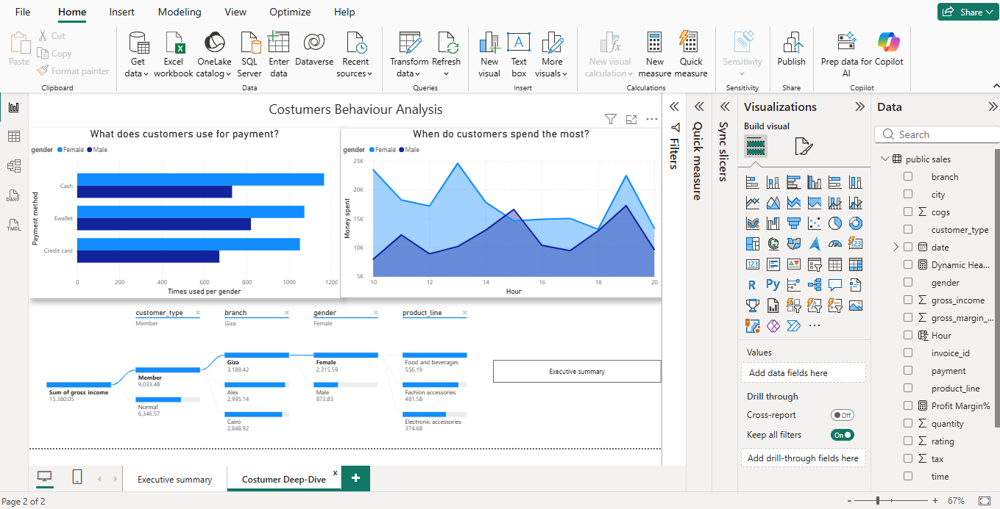

# Supermarket-Sales-Analysis
End-to-end analysis of supermarket sales using PostgreSQL for ETL/EDA and Power BI for interactive visualization.
# Supermarket Sales: End-to-End SQL & Power BI Analysis

## 📌 Project Overview
An analytical deep dive into supermarket performance across three branches (Alex, Cairo, Giza). This project demonstrates a full data pipeline: from **SQL Data Engineering** in PostgreSQL to **Executive Dashboards** in Power BI.

---

## 🛠️ Tech Stack
- **Database:** PostgreSQL (pgAdmin 4)
- **Visualization:** Power BI Desktop
- **Language:** SQL, DAX
- **Dataset:** [Kaggle Supermarket Sales](https://www.kaggle.com/datasets/faresashraf1001/supermarket-sales)

---

## ⚙️ Data Engineering & ETL (PostgreSQL)
I performed rigorous data cleaning and validation using SQL to ensure report accuracy:
- **Environment Fix:** Resolved MDY date format conflicts using:
  `ALTER DATABASE supermarket_sales_db SET datestyle TO "ISO, MDY";`
- **Integrity Audit:** Verified 1,000 records and confirmed financial accuracy where `Total = COGS + Tax` within a 0.01 margin of error.
- **EDA Discovery:** Identified that Gross Income follows a perfectly linear distribution relative to sales, suggesting a synthetic dataset with fixed margin rules.

---

## 💡 Key Insights
### 1. The Rush Hour Pulse
SQL extraction identified peak traffic windows:
- **13:00, 15:00, and 19:00** are the primary transaction spikes.
- **Strategy:** Increase checkout staffing during these windows to reduce wait times.

### 2. Branch Performance
- **Alex and Cairo** show nearly identical revenue distributions, suggesting market saturation parity in these regions.

---

## 📊 Dashboard Preview

---

## 📂 Project Structure
- `/SQL_Scripts`: Full `analysis_queries.sql` including Window Functions and CTEs.
- `/Dataset`: Raw `sales.csv` source data.
- `/Reports`: Interactive `.pbix` Power BI file.
